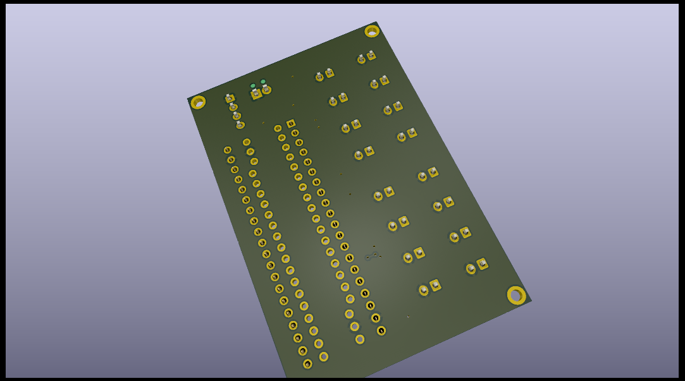

# SensorProject_t16-f401-pcb
Connect multiple temperature sensors to an analog digital converter.

##  Contents

See the auto-generated menu in the github README display (above right).

## Summary

Kicad project WIP. (Version 0.1.0 2024-06 needs pull up resistors on the I2C lines.)

PCB design to connect multiple (up to 16) thermistor temperature sensors to an ads1115 with I2C
output to connect to an MCU. Connectors are  as commonly used on NTC 10K 3950 sensors.
These are inexpensive and easily available in lengths up to 3m. 
The MCU socket is arranged for a blackpill module.

The `.png` files are produced from kicad  in the `3D Viewer`  with `File > Export Current View as PNG`.

