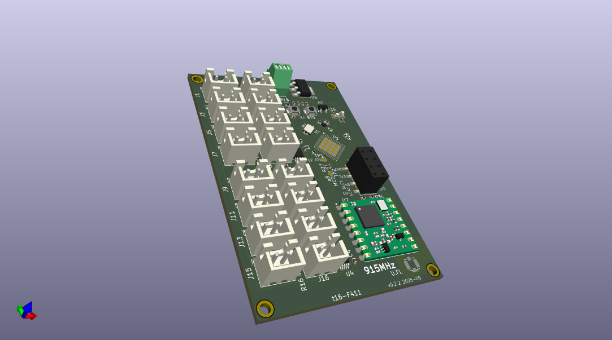
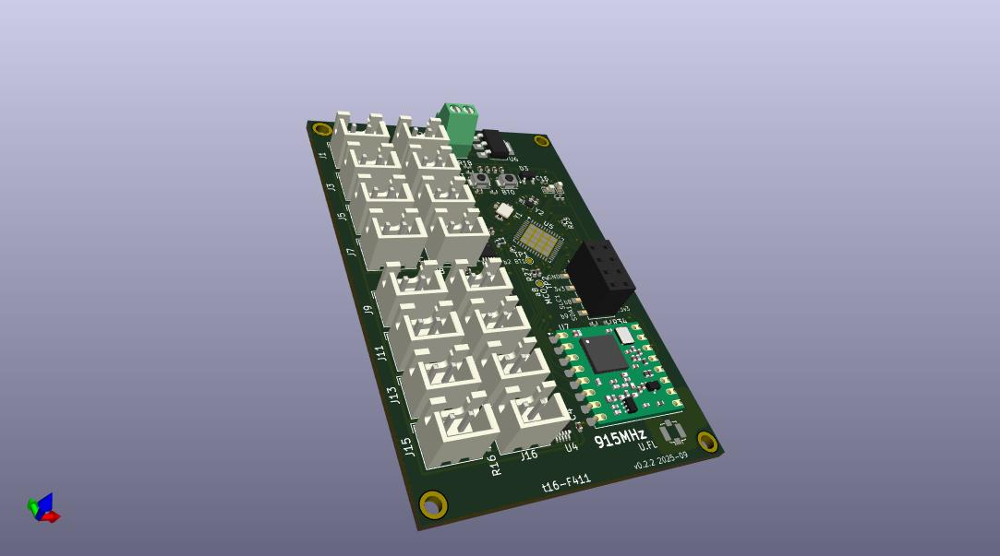
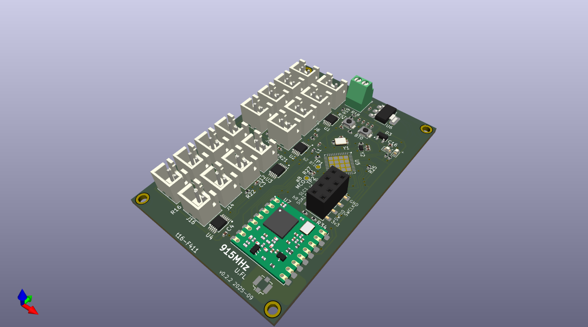
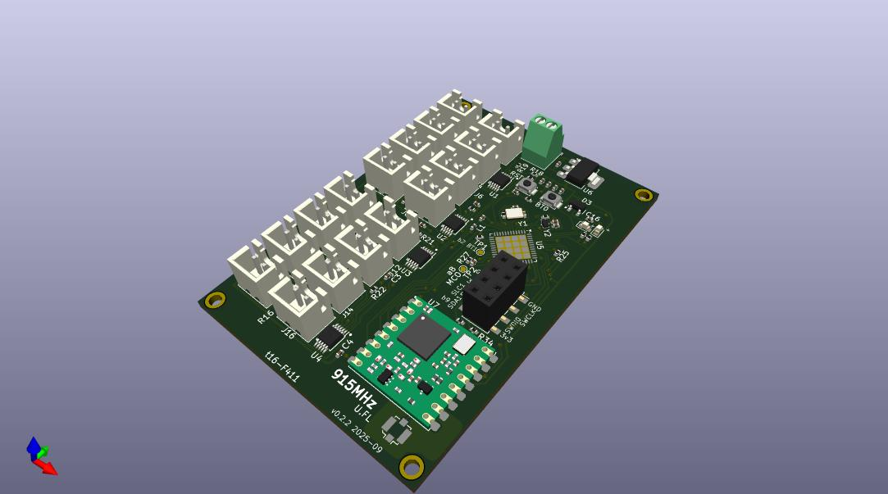
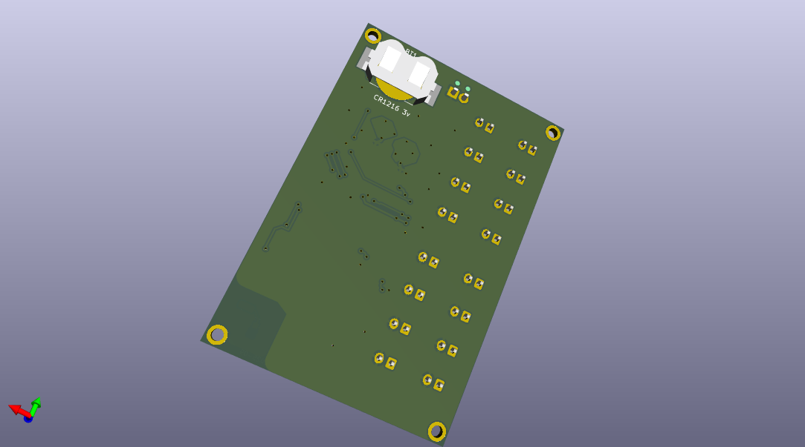
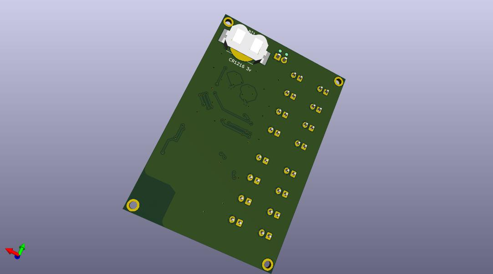

# SensorProject_t16-pcb
Connect multiple temperature sensors to an analog digital converter.

##  Status: Prototype.

## Summary

Kicad project WIP.

PCB design to connect multiple (up to 16) thermistor temperature sensors to an ads1115 with I2C
output to connect to an MCU. Connectors are  2-pin JST XH_B2B-XH-A, as commonly used on NTC 10K 3950 sensors.
These sensors are inexpensive and easily available in lengths up to 3m. 
Measurements are broadcast with LoRa.

Related software is in repository https://github.com/pdgilbert/SensorProject_t16.

The `.png` and `jpg` files are produced from kicad in the `3D Viewer`  with `File > Export Current View as ...`.

## History

 - Version 0.2.2 2025-09 includes an stm32f411 MCU. It is not yet tested.

 - Version 0.2.0 2025-05 includes an stm32f411 MCU. It has a LoRa module RFM95W.
   It needs some hardware re-adjustment to work.

 - Version 0.1.1 2025-01 has pull up resistors added but has not been manufactured/tested.

 - Version 0.1.0 2024-05 needs manual addition of pull up resistors on the I2C lines. 
   With this modification it works with `blackpill` `stm32f401` or `stm32f411` inserted.
   This versin has no LoRa module.
